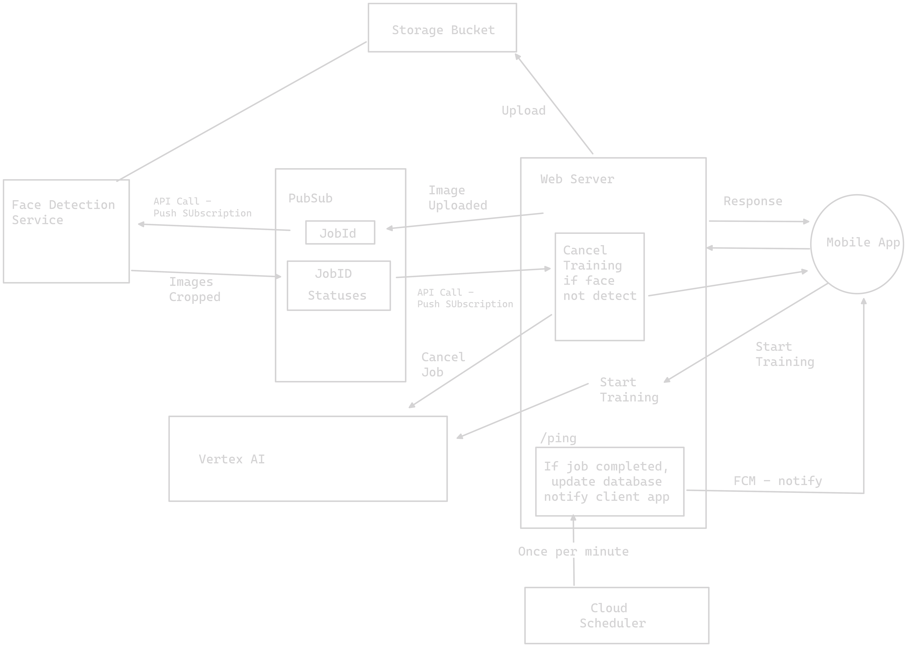

# Web App Services and Iterations

## Introduction

This document provides an overview of the services and iterations of our web app. The app comprises several services:

1. **Client-side app**: Developed in SwiftUI.
2. **Web server**: Initially deployed in Flask.
3. **Face detection and face grouping service**: A separate service for image processing.
4. **Vertex AI**: Used for running machine learning jobs on Google Cloud Platform.

The main flow of the app involves the user selecting and uploading pictures from the mobile app to the server. The server then uploads these images to the storage bucket while concurrently processing them using the face detection service. Once the images are uploaded and preprocessed, the server calls the Vertex AI API to start a training job on the images. The client periodically checks with the server to see if the job status is complete. Once complete, the server generates URLs for the processed images and sends them back to the client as a response.

## First Iteration

In the first iteration, the face detection service was embedded within the web server. This meant that the face detection code ran on the same instance as the web server. While the face detection service could run using CPUs, it was more efficient with GPUs, making it compute-intensive. This posed a problem for scaling as scaling the web app also meant scaling the service due to their linkage. 

Another issue was the slow process of generating URLs for the processed images. Sequential API calls were slow, and the alternatives, such as spawning multiple threads for concurrent API calls or using the AsyncIO library in Python, were either heavy on the operating system or required significant developer hours.

## Second Iteration

In the second iteration, the web server was rewritten in TypeScript. This change brought several benefits:

1. **Small Docker image size**: The TypeScript code was bundled using ES build, resulting in a small Docker image size.
2. **Easy scaling**: The small image size allowed for easy scaling with negligible cold start timing.
3. **Instantaneous response**: The server could instantly respond to client requests.

The image processing service was decoupled from the web server and deployed as a standalone instance, still written in Python. This decoupling meant that even if there were cold start times associated with the face detection service, the user experience was not directly affected.

The new process involved the web server uploading images to cloud storage and publishing a topic onto PubSub. The face detection service, subscribed to this topic, would then process the images and publish a topic indicating that the images were preprocessed. The web server would then handle the response accordingly.

## Comparison of the Two Iterations

The shift from Python to TypeScript for the web server brought about significant improvements in terms of scalability and response times. The decoupling of the image processing service from the web server allowed for more efficient use of resources and improved the user experience by reducing the impact of cold start times.

The use of PubSub for communication between the web server and the face detection service streamlined the image upload and processing process, making it more efficient and reliable.

## Why Shift from Python to TypeScript?

The shift from Python to TypeScript for the web server was primarily driven by the need for better scalability and performance. TypeScript, with its small Docker image size and negligible cold start timing, provided a more scalable solution. 

Additionally, TypeScript's ability to provide instantaneous responses to client requests improved the overall user experience. The asynchronous nature of TypeScript also made it easier to handle multiple requests concurrently, further enhancing performance.

In conclusion, the shift to TypeScript for the web server resulted in a more scalable, efficient, and user-friendly web app.